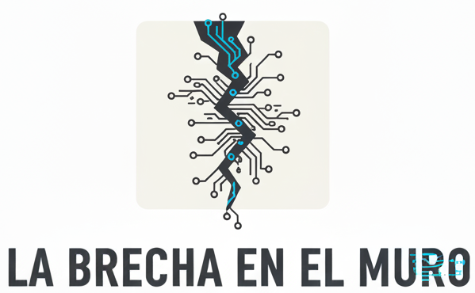

---
date:
  created: 2025-10-19
---

# Introducción

Mi día a día es un puente entre dos mundos apasionantes: por un lado, explico en la universidad la magia (y las matemáticas) detrás de los accionamientos eléctricos y los sistemas de control; por el otro, lidero un equipo de desarrollo backend donde la inteligencia artificial se está convirtiendo en mi compañera de viaje favorita para automatizar tareas y resolver problemas complejos. Este blog es ese puente, el lugar donde conecto los principios sólidos de la ingeniería con las posibilidades infinitas del software.
<!-- more -->
Soy Vladímir, y me desenvuelvo como Team Lead en desarrollo backend. Cuando no estoy revisando código o coordinando al equipo, probablemente me encuentres en un aula, intentando contagiar a mis estudiantes de la misma curiosidad que a mí me motiva. Aquí no vas a encontrar teoría abstracta ni posts genéricos. Esto es mi cuaderno de bitácora: un espacio donde desempolvo los desafíos técnicos que me quitan el sueño (en el buen sentido) y comparto las soluciones que encuentro, siempre con una taza de café en la mano.

Si te gusta lo práctico, lo probado y lo útil, estás en el lugar correcto. Espera encontrar:

*   **"Cómo lo hice":** Tutoriales paso a paso sobre cosas que he implementado. Desde un script de Python con IA que optimiza nuestros despliegues, hasta cómo estructuramos una API para ser resiliente.
*   **"Herramientas que no fallan":** Recomendaciones de librerías, frameworks o servicios que realmente uso y que me salvan la vida en el día a día.
*   **"El porqué de las cosas":** Análisis de tendencias, pero desde la trinchera. ¿Realmente vale la pena usar X tecnología? ¿Cómo está cambiando la IA la forma en que escribimos código los equipos backend?
*   **"Desmontando el problema":** Esos bugs o desafíos de arquitectura que parecen imposibles... hasta que dejan de serlo. Te muestro mi proceso para resolverlos.

Este espacio está pensado para **tí**, ya seas un colega con el que poder debatir ideas, un estudiante con hambre de saber cómo se aplica la teoría en el mundo real, o simplemente alguien curioso que, como yo, cree que la mejor manera de aprender es compartiendo.

Los comentarios están abiertos, el debate es bienvenido. Si algo de lo que lees te genera una idea, una duda o una solución mejor, **¡me encantaría saberlo!** Puedes dejarme un comentario o encontrarme en :fontawesome-regular-face-laugh-wink:.

¡Gracias por pasar y bienvenido a bordo!